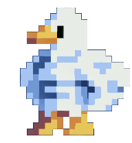

# Pixel Duck for Codex

Pixel Duck is a tiny pixel-art companion for Codex Desktop. It uses the
original eight-frame turn in every Codex state, so the duck spins smoothly
instead of switching to a separate jumping animation.

<p align="center">
  
</p>

## Install

Clone the repository and run the local installer:

```sh
git clone https://github.com/FlamurMaliqi/codex-pixel-duck.git
cd codex-pixel-duck
./install.sh
```

Then open **Codex → Settings → Pets** and select **Refresh**.

Manual installation works too:

```sh
mkdir -p "${CODEX_HOME:-$HOME/.codex}/pets/pixel-duck"
cp pet.json spritesheet.webp "${CODEX_HOME:-$HOME/.codex}/pets/pixel-duck/"
```

## Package

- `pet.json` is the Codex runtime manifest.
- `spritesheet.webp` is a v1 `1536 × 1872` atlas: 8 columns, 9 rows,
  `192 × 208` pixels per cell.
- `assets/spin-preview.gif` shows the animation without requiring Codex.
- `scripts/validate.py` checks the package using only Python's standard
  library.

Run the same check used by continuous integration:

```sh
python3 scripts/validate.py
```

## Community catalogs

This repository is intended to be the single source of truth for Pixel Duck.
The same pet can then be listed in community catalogs instead of copying or
merging their codebases:

- [Awesome Codex Pet](https://github.com/legeling/awesome-codex-pet)
- [Petdex](https://github.com/crafter-station/petdex)
- [Codex Anime Pets](https://github.com/chenxin-dlut/codex-anime-pets)
- [GitHub's `codex-pets` topic](https://github.com/topics/codex-pets)

Those projects remain independent and retain their own licenses. See
[`DISTRIBUTION.md`](DISTRIBUTION.md) for the publication plan.

## License

The scripts and documentation are MIT licensed. The duck artwork and derived
media are handled separately; read [`ASSET-NOTICE.md`](ASSET-NOTICE.md) before
publishing or redistributing them.

This is an unofficial community project and is not affiliated with OpenAI.
